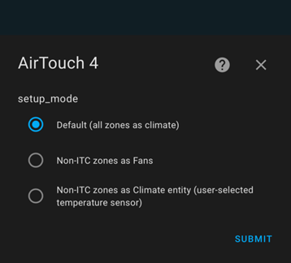
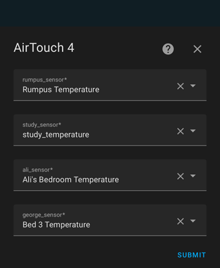

# Airtouch4

Custom version of official AirTouch4 Integration from Home Assistant

⚠️This integration is neither AirTouch official nor Home Assistant official. **Use at your own risk.** ⚠️

**Objective**:

The main issue/lacking feature in the core integration is that zones without an ITC (inidividual temperature control) are not represented correctly, ie:

* because they have no ITC, the current temperature value was fictional (154.7°C) when represented in a Climate entity
* because it was represented as a Climate entity, there was no visibilty or control of the fan speed/percentage (or rather, the open/close percentage of the zone dampener)

**Result**:

When loading the integration, this version now determines if the zone has an ITC or not.

No change has been made to zones with an ITC. They continue to be created as Climate entities.

Zones without an ITC can now be created as:

* Fan entities, enabling:
  
  * On / Off control
  * Fan Speed control (in percent, with the same 5% incremements as the AirTouch system interface)
    
    These fan zones are represented in the same way that the AirTouch panel/phone app shows them, ie: they will still show as On if the zone is enabled, but the main AC system is Off.
* Climate Entities - if a valid temperature sensor is provided, enabling:
  
  * Zones now created as climate entities
  * Current temperature based on user-configured temperature sensor
  * Automated fan/damper percentage control based on target temperature


## Installation

As this is a custom version of an official integration, the process is manual, but fairly straight forward.

### Manual Install

1. Download this repository
2. Create `custom_components/airtouch4` folder in your config directory
3. Copy the files into it (Just drag & drop whole files would be fine)
4. Restart Home Assistant

```
{path_to_your_config}
├── configuration.yaml
└── custom_components
    └── airtouch4
        ├── __init__.py
        ├── climate.py
        ├── config_flow.py
        ├── const.py
        ├── coordinator.py
        ├── fan.py
        ├── manifest.json
        └── strings.json
```

## Configuration

1. In Home Assistant, add the AirTouch integration as you would a standard integration (Settings > Devices & Services > Add Integration.
2. Search for AirTouch4, which should now have a red "custom integration" box icon to the right. This indicates that the custom copy will be loaded rather than the official version.
   
   
3. Enter the IP address of your AirTouch4 system (the tablet/panel).
   
   
4. Select the setup mode:
   
   
   
   1. **Default**: configures all zones as standard climate entities.
   2. **Non-ITC zones as Fans**: any zone without an ITC will be created as a fan instead, giving you     percentage control as in the AirTouch app.
   3. **Non-ITC zones as Climate entity**: allows the user to select any available HA temperature sensor for use with the non-ITC zones. A climate entity is then created and uses this sensor as the current temperature for the zone. This gives the user normal temperature control and visibility as a climate entity. The integration attempts to automatically adjust the zone fan/damper percentage automatically to mimic a proper ITC zone.
      
      
5. The system will now add in the following the main Aircon system (likely labelled AC 0), and climate zones and/or fans based on the selected setup mode.

## Example dashboard:

Three dashbopard examples are shown below, representing each of the setup modes, noting the following:

1. Air-Con is the main "AC 0" entity created, for which the HVAC_MODE and Fan speed is available, as standard regardless of the setup mode.
2. The example zones that DO have an ITC are Master, Kitchen and Juni. Note that you can only control the target temperature, so there's no need to try and show the HVAC_MODE feature. These zones are created as normal climate zones regardless of the setup mode.
3. The example zones that DO NOT have an ITC are Ali, George, Study & Rumpus, and thus are represented differently depending on the setup mode as described below.
4. as Fans.Fan zones maintain the last set fan speed as noted by the state information and represented in the AirTouch4 panel/app state (though the app doesn't show the percentage when the zone is off)


**Default mode:** all created as climate zones, but note the false 154.7°C current temperature for the bottom four zones


**Non-ITC zones as Fans:** Fan zones maintain the last set fan speed as noted by the state information and represented in the AirTouch4 panel/app state (though the app doesn't show the percentage when the zone is off). This setup mode best mimics the standard AirTouch app functionality.


**Non-ITC zones as Climate entity**: note that the bottom four zones now show as climate zones again, but with real current temperature values, based on the sensors selected during setup. Also note, for info, in the "Ali" zone in this example, these zones have an attribute for the open percentage (fan speed), 30% in this example.


#### TODO:

* monitor and improve the automatic damper control for the Non-ITC zones as climate entity
* improve HA interface refresh speed when reading parameters. You may see some delay in the interface update
* 

#### Disclaimer:

I have implemented these changes which work with my single ducted system. Unfortunately I cannot test for multiple AC systems but that functionality should still operate as normal. Likewise, the assumption is that all non-ITC zones only have ON (fan-only) and OFF modes and not other HVAC modes.

