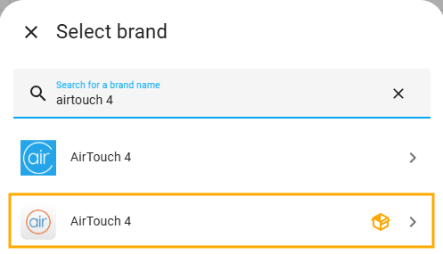
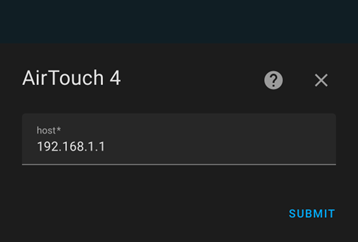
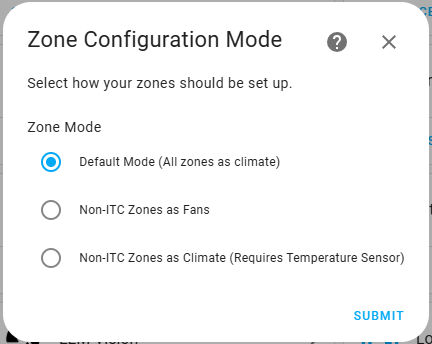
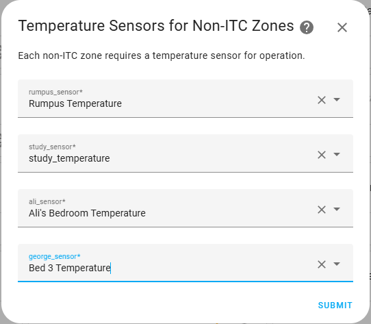
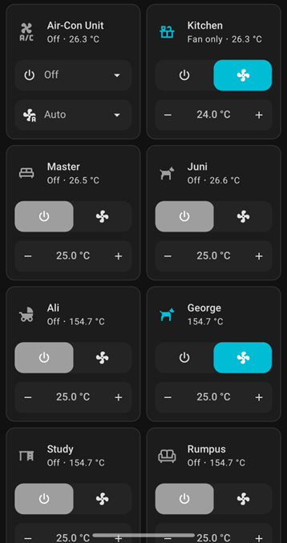
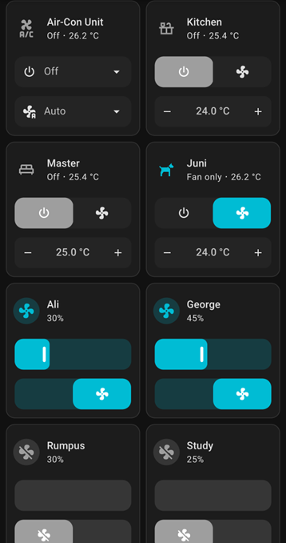
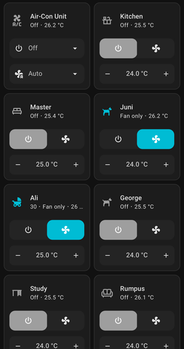

# 🌡️ AirTouch4 Advanced


> Custom version of the official AirTouch4 Integration for Home Assistant with enhanced zone control and configuration options.

⚠️ **Disclaimer:** This integration is neither officially supported by AirTouch nor Home Assistant. **Use at your own risk.** ⚠️

## 📋 Table of Contents

- [Features](#-features)
- [Installation](#-installation)
- [Configuration](#-configuration)
- [Zone Modes](#-zone-modes)
- [Reconfiguring Temperature Sensors](#-reconfiguring-temperature-sensors)
- [Dashboard Examples](#-dashboard-examples)
- [Troubleshooting](#-troubleshooting)
- [Changelog](#-changelog)
- [To-Do](#-to-do)
- [Disclaimer](#-disclaimer)

## ✨ Features

This custom integration addresses key limitations in the official AirTouch4 integration:


| Issue                                                     | Solution                                                        |
| ----------------------------------------------------------- | ----------------------------------------------------------------- |
| Fictional temperature values (154.7°C) for non-ITC zones | Option to use real temperature sensors or represent as fans     |
| Lack of visibility/control over damper percentages        | Direct fan speed control or automated temperature-based control |
| No reconfiguration ability                                | Temperature sensor mappings can now be updated after setup      |

### Enhanced Zone Handling:

* Zones **with** ITC: Continue to work as standard climate entities
* Zones **without** ITC: Now have two alternate configuration options:
  * **Fan Entities:** Control damper open percentage directly
  * **Climate Entities:** Use external temperature sensors for proper climate control

## 📥 Installation

### Option 1: HACS Installation (Recommended)

1. Install [HACS](https://hacs.xyz/) if you haven't already
2. Open HACS in Home Assistant
3. Go to "Integrations" tab
4. Click the three dots in the top right corner and select "Custom repositories"
5. Add `https://github.com/0xAHA/airtouch4_advanced` as a custom repository (Category: Integration)
6. Search for "Airtouch4 Advanced"
7. Click the download button (⬇️)
8. Restart Home Assistant

### Option 2: Manual Installation

1. Download this repository
2. Create a `custom_components/airtouch4_advanced` folder in your Home Assistant config directory
3. Copy the downloaded files into the new folder:

```bash
{path_to_your_config}
├── configuration.yaml
└── custom_components
    └── airtouch4_advanced
        └── translations
        |   ├── en.json
        |   ├── de.json
        |   ├── es.json
        |   └── ... (other language files)
        ├── __init__.py
        ├── climate.py
        ├── config_flow.py
        ├── const.py
        ├── coordinator.py
        ├── fan.py
        └── manifest.json
```

4. Restart Home Assistant

## ⚙️ Configuration

1. In Home Assistant, go to **Settings > Devices & Services** and click **Add Integration**
2. Search for "AirTouch4" (look for the one with a red "custom integration" box icon)

   
3. **IP Address Detection**: The integration will attempt to automatically detect your AirTouch4 system

   * If auto-detection fails, enter the IP address of your AirTouch4 system (tablet/panel)

   

## 🔍 Zone Modes

4. Select one of three zone configuration modes:

   


| Mode                         | Description                                  | Best For                                                |
| ------------------------------ | ---------------------------------------------- | --------------------------------------------------------- |
| **Default Mode**             | All zones as climate entities                | Simple setups where actual temperatures aren't critical |
| **Non-ITC zones as Fans**    | Zones without ITC as fan entities            | Direct control over damper percentages                  |
| **Non-ITC zones as Climate** | Select temperature sensors for non-ITC zones | Full climate control with external temperature sensors  |

5. If you choose "Non-ITC zones as Climate," you'll be prompted to select temperature sensors for those zones:

   
6. The integration will add all components to your Home Assistant instance:

   * Main AC unit (typically "AC 0")
   * All zones as either climate or fan entities based on your selection

## 🔄 Reconfiguring Temperature Sensors

**New in Version 2.0.2**: You can now update temperature sensor mappings after initial setup!

To reconfigure your temperature sensors:

1. Go to **Settings > Devices & Services**
2. Find your AirTouch4 integration
3. Click on **Configure**
4. Select new temperature sensors for your non-ITC zones
5. Click **Submit** to save your changes

> **Note:** Reconfiguration is only available when using the "Non-ITC zones as Climate" mode.

## 📊 Dashboard Examples

### Default Mode

All zones as climate entities (note the incorrect 154.7°C for non-ITC zones)



### Non-ITC Zones as Fans

Fan entities with direct percentage control



### Non-ITC Zones as Climate

Climate entities with actual temperature readings from sensors



**Key Components in All Setups:**

* "Air-Con" - The main AC unit with full HVAC mode and fan speed control
* Zones with ITC (e.g., "Master," "Kitchen") - Standard climate entities in all modes
* Zones without ITC (e.g., "Ali," "George") - Representation varies by setup mode

## 🔧 Troubleshooting

If you encounter issues with the integration:

1. **Enable Debug Logging**

   Add this to your `configuration.yaml`:

   ```yaml
   logger:
     default: info
     logs:
       custom_components.airtouch4_advanced: debug
   ```
2. **Common Issues**

   * Integration not finding your AirTouch system: Verify the IP address is correct
   * Temperature sensors not updating: Check that your selected sensors are working
   * Damper control not responding: Ensure your AirTouch system is online
3. **Submit Issues**

   If you encounter persistent issues, please report them on the [GitHub repository](https://github.com/0xAHA/airtouch4_advanced/issues) with:

   * Home Assistant version
   * AirTouch4 Advanced version
   * Debug logs
   * Steps to reproduce the issue

## 📝 Changelog

### Version 2.0.3

- ✅ Nothing of note - Github user handle change only

### Version 2.0.2

- ✅ Added ability to reconfigure temperature sensors for non-ITC zones in climate mode
- ✅ Added translations for 11 languages (Spanish, German, French, Italian, Dutch, Swedish, Chinese Simplified, Chinese Traditional, Japanese, Korean, Portuguese)
- ✅ Fixed issues with setup and configuration flows
- ✅ Improved error handling and user feedback

### Version 2.0.1

- Initial HACS release
- Support for representing non-ITC zones as fans or climate entities
- Temperature-based automatic damper control

## 📋 To-Do

* Monitor and improve automatic damper control for non-ITC zones configured as climate entities
* Improve HA interface refresh speed when reading parameters
* Add support for more granular fan speed control

## ⚠️ Disclaimer

These changes are tested with a single ducted system. Functionality with multiple AC systems should still operate normally, but it remains untested. This integration assumes that all non-ITC zones only have ON (fan-only) and OFF modes.

---

If you find this integration useful, please consider starring the repository!
