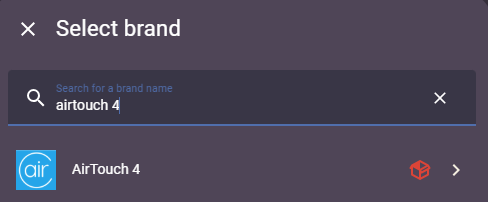

# Airtouch4

Custom version of official AirTouch4 Integration from Home Assistant

⚠️This integration is neither AirTouch official nor Home Assistant official. **Use at your own risk.** ⚠️


**Objective**:

The main issue/lacking feature in the core integration is that zones without an ITC (inidividual temperature control) are not represented correctly, ie:

* because they have no ITC, the current temperature value was fictional (154.7°C) when represented in a Climate entity
* because it was represented as a Climate entity, there was no visibilty or control of the fan speed/percentage (or rather, the open/close percentage of the zone dampener)

**Result**:

When loading the integration, this version now determines if the zone has an ITC or not.

No change has been made to zones with an ITC. They continue to be created as Climate entities

Zones without an ITC are now created as Fan entities, enabling:

* On / Off control
* Fan Speed control (in percent, with the same 5% incremements as the AirTouch system interface)

These fan zones are represented in the same way that the AirTouch panel/phone app shows them, ie: they will still show as On if the zone is enabled, but the main AC system is Off.


## Installation

As this is a custom version of an official integration, the process is manual, but fairly straight forward.


### Manual Install

1. Download this repository
2. Create `custom_components/airtouch4` folder in your config directory
3. Copy the files into it (Just drag & drop whole files would be fine)
4. Restart Home Assistant

```
{path_to_your_config}
├── configuration.yaml
└── custom_components
    └── airtouch4
        ├── __init__.py
        ├── climate.py
        ├── config_flow.py
        ├── const.py
        ├── coordinator.py
        ├── fan.py
        ├── manifest.json
        └── strings.json
```


## Configuration

1. In Home Assistant, add the AirTouch integration as you would a standard integration (Settings > Devices & Services > Add Integration.
2. Search for AirTouch4, which should now have a red "custom integration" box icon to the right. This indicates that the custom copy will be loaded rather than the official version.

   
3. Enter the IP address of your AirTouch4 system (the tablet/panel).
4. The system will now add in the following:

   1. Main aircon system (likely labelled AC 0) - the same as the original integration
   2. Climate entities - for those zones which have an Individual Temperature Control (ITC) unit in the room
   3. Fan Entities - for those zones which do NOT have an ITC, and therefore aren't represented properly as Climate entities in the standard integration.
